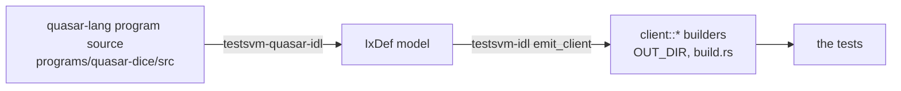

# Quasar dice

A commit-reveal dice game written as a native [Quasar](https://github.com/blueshift-gg/quasar)
program (pure SOL custody, a percentile roll settled by instruction introspection), and
**specified by the tests that drive it**.

There is no separate prose spec of what this game does. The behavior is the test suite: each
scenario is one hand, start to finish, and the program is whatever makes those hands play out
right. This README reads the project the same way: the scenarios first, the mechanics they rely
on after.

```
05-dice/
├── programs/quasar-dice/   the program (cargo build-sbf)
└── dogfood/                the testsvm-quasar suite + the rendered report
```

> An LLM came in handy to investigate and prototype the instruction introspection for Quasar.

## A round, in one picture

```mermaid
stateDiagram-v2
    [*] --> Open
    Open --> Bet: place_bet (guess + entropy + stake)
    Open --> Closed: close_table (house reclaims an unplayed table)
    Bet --> Settled: reveal + resolve_bet (house pays a winner)
    Bet --> Refunded: refund_bet (timeout; player reclaims)
    Settled --> [*]
    Refunded --> [*]
    Closed --> [*]
```



The house opens a table posting `commitment = sha256(preimage)`; a player bets against it with
their own `entropy`, a guess, and a stake; the house reveals and settles, or the player walks
after a timeout. The roll is `sha256(preimage ++ entropy)`, so neither side fixes it alone.

## The scenarios are the spec

### Scenario 1: the house pays a winning roll

The happy path, one hand start to finish. Pick a roll the player beats, open a table committed
to that preimage, bet one above, then reveal-and-settle:

```rust
let (preimage, roll) = preimage_where(|r| r <= 98);
let table = open_table(&mut backend, 1, preimage);    // house funds the vault + posts sha256(preimage)
let player = backend.actor("Player", PLAYER_FUNDS);

let bet = place_bet(&mut backend, &table, &player, roll + 1);          // guess one above the roll
let tx = reveal_and_settle(&mut backend, &table, &player.pubkey(), bet, &table.preimage);

assert!(tx.error.is_none());
assert_eq!(lamports(&backend, &player.pubkey()), player_start - STAKE + payout); // collected the payout
assert_eq!(lamports(&backend, &bet), 0);                                          // the wager is closed
```

The assertions are the specification: a winner collects the payout net of the stake, and the
wager closes. The verbs hide what you don't want in a test: `open_table` posts the commitment,
`place_bet` derives the bet PDA, and `reveal_and_settle` packs the two-instruction settle the
introspection needs (below), so the test talks about the table, not the bytes.

### Scenario 2: the house keeps a losing roll

A guess that ties the roll loses (the house wins ties). The settle introspects the reveal, finds
no win, and the stake stays in the vault — `assert_eq!(vault, vault_start + STAKE)`.

### Scenario 3: a switched preimage is caught

The first negative-space scenario. The house tries to settle with a preimage that does *not*
open the table's commitment:

```rust
let mut switched = table.preimage;
switched[0] ^= 0xff;                                   // not the committed preimage
let tx = reveal_and_settle(&mut backend, &table, &player.pubkey(), bet, &switched);

assert!(tx.error.is_some());                           // rejected (CommitRevealMismatch)
assert!(lamports(&backend, &bet) > 0);                // the wager survives a failed settle (atomic)
```

`resolve_bet` recomputes `sha256(preimage)` and rejects the mismatch; the transaction is atomic,
so the wager survives. This is the test that says the house cannot grind the reveal.

### Scenario 4: the house never shows

The house dislikes the roll and stays silent. After the timeout the player reclaims the stake:
`warp_to_slot(placed_at + REFUND_TIMEOUT_SLOTS + 1)`, then `refund_bet` makes the player whole
(`player == player_start`) and closes the wager.

### Scenario 5: the house closes an empty table

A table opened but never bet against: `close_table` reclaims the rent to the house, and the
table closes.

### Scenario 6: a close-and-reopen grind is caught

The deepest negative-space scenario, and the reason a guard exists. Once a player has bet, the
table is **claimed**, and a claimed table cannot be closed:

```rust
let _bet = place_bet(&mut backend, &table, &player, 50);   // claims the table
let tx = backend.send(&[client::CloseTable { /* .. */ }.ix()], &[&table.house]);

assert!(tx.error.is_some());                               // rejected (TableInUse)
assert!(lamports(&backend, &table.pubkey) > 0);            // the table survives
```

Without this guard the house could close a live round and reopen it (same seed) with a commitment
ground to lose against the player's now-visible entropy. The test pins the guard shut.

The six scenarios and their pages are indexed (with a link back to each test) in
[`dogfood/report/index.md`](dogfood/report/index.md).

## The hard primitive: instruction introspection

The settle is one transaction carrying **two** instructions, `[reveal, resolve_bet]`.
`resolve_bet` reaches back to the preceding `reveal` through the Instructions sysvar to recover
the preimage and confirm the house signed it. Proving that parse works on a live engine is the
whole point of the suite.

```mermaid
sequenceDiagram
    autonumber
    participant House
    participant dice
    participant System
    House ->> dice: reveal(preimage)
    House ->> dice: resolve_bet
    dice ->> dice: introspect the preceding reveal; check sha256(preimage) == commitment
    dice ->> System: Transfer (vault pays the winner, invoke_signed)
```

`reveal_and_settle` builds both `client::Reveal` and `client::ResolveBet` and sends them in one
transaction, so the test never spells out the dance; it just settles.

## How the roll works (and why it's fair)

A two-party commit-reveal over `sha256`; the clock is never an entropy source (slot only times
the refund). The roll mixes both contributions:

```
roll = ((lower_128(h) + upper_128(h)) mod 100) + 1     // h = sha256(preimage ++ entropy), roll in 1..=100
win  ⇔  guess > roll                                   // "roll under the guess"
payout = stake × (10000 - 150) / (guess - 1) / 100     // a flat 1.5% house edge at every target
```

- **The house cannot grind.** It posts `sha256(preimage)` on-chain in `open_table` *before* the
  player chooses `entropy`, so the chain witnesses the ordering and `sha256` collision-resistance
  pins it to that one preimage. Scenario 3 is this, made executable.
- **The player cannot predict.** The roll needs the preimage; the player holds only its hash.
- **The house cannot stall its way out.** If it never reveals, scenario 4 refunds the player.

Higher target, safer bet, smaller multiple; lower target, long shot, bigger multiple; the same
1.5% edge at every target. (Stake 0.05 SOL, guess 48: win ~47% of the time, ~2.1× on a win.)

## Where the instruction builders come from

Nothing above hand-packs a discriminator byte. The program declares its instructions in source
(quasar-lang `#[instruction(discriminator = N)]` fns + `#[derive(Accounts)]`), and a build-time
pipeline turns that declaration into the typed `client::*` builders the tests use:



`testsvm-quasar-idl` reads the program source directly (no `quasar idl-build`, no IDL JSON), so
the client cannot drift from the program. The 32-byte `commitment`/`entropy`/`preimage` args
ride through as `[u8; 32]`.

## The report: pages, an index, and a fingerprint

Each scenario emits two things (`capture` in `tests/gambling.rs`): a lossless JSON record and a
crime-scene page under `dogfood/report/` (structured execution log, sequence diagram, authority
+ ownership graphs the program's own `is_ok()` cannot show). `cargo run --example report` folds
the records into:

- **`index.md`** — a table with a **Source** link back to the test that produced each row.
- **`fingerprint.txt`** — the behavioral signature (sha256-Merkle over the normalized traces).
  The cast is deterministic, so it's byte-stable run to run; `cargo run --example report -- --check`
  is the regression gate, and it doubles as the mutant-kill oracle.

A taste of the winning-roll page's structured log (the two `dice` frames are the introspection):

```
CPI Tree (3,485 BPF CU / 1,400,000 budget):
├── reveal (43 CU) dice (no CPIs)
└── resolve_bet (3,442 CU) dice
    └── System::Transfer            // the vault pays the winner, invoke_signed
```

## Build and test

```sh
cd programs/quasar-dice && cargo build-sbf   # the program
cd dogfood && cargo test                     # drive the .so through testsvm-quasar
cd dogfood && cargo run --example report     # fold records -> index.md + fingerprint.txt
```
