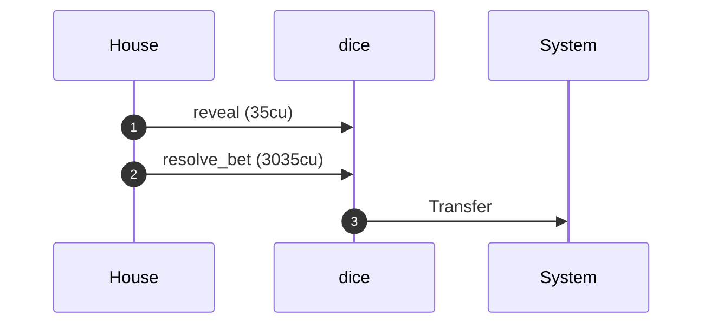
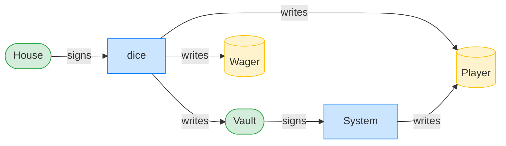
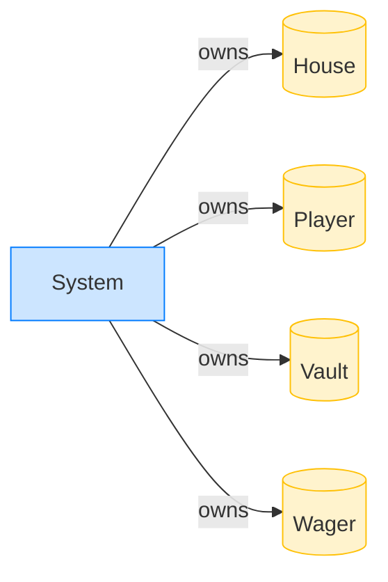

# Quasar dice

A commit-reveal dice game written as a native [Quasar](https://github.com/blueshift-gg/quasar)
program: pure SOL custody, a percentile roll settled by instruction introspection, and a
gambling-themed test suite that drives it through the `testsvm-quasar` engine.

```
05-dice/
├── programs/quasar-dice/   the program (cargo build-sbf)
└── dogfood/                the testsvm-quasar suite + scenario report
```

## Disclosure

An LLM came in handy to investigate and prototype the instruction introspection for Quasar.

## The table

Five instructions, played as a table:

| # | Instruction   | Who signs | What happens |
|---|---------------|-----------|--------------|
| 0 | `initialize`  | house     | seeds the house vault PDA with a bankroll |
| 1 | `place_bet`   | player    | records a guess, the house `commitment` + player `entropy`, deposits the stake |
| 2 | `reveal`      | house     | a marker carrying the preimage (see below) |
| 3 | `resolve_bet` | house     | settles the bet; pays a winner from the vault |
| 4 | `refund_bet`  | player    | reclaims a stale, never-revealed bet after a timeout |

The vault is a PDA at `["vault", house]`; it holds the bankroll and signs payouts with
`invoke_signed`. Each bet is a PDA at `["bet", vault, player, seed]`, closed back to the
player when the bet settles or refunds.

## How the randomness works

It is a **two-party commit-reveal** scheme over `sha256`; the clock is never an entropy source
(slot is recorded only to time the refund). Both sides contribute:

1. The house picks a random 32-byte `preimage` and computes `commitment = sha256(preimage)`.
2. The player places a bet carrying that `commitment`, the player's own 32-byte `entropy`, a
   guess, and a stake.
3. To settle, the house sends `reveal(preimage)` and `resolve_bet` in **one transaction**.
   `resolve_bet` reads the preceding `reveal` out of the Instructions sysvar (this is the
   introspection), then checks `sha256(preimage) == commitment`. A preimage that does not
   open the commitment is rejected (`CommitRevealMismatch`).

The roll mixes both contributions: `sha256(preimage ++ entropy)`. The commitment binds the
house (`sha256` is collision-resistant, so it can only reveal the one preimage that opens the
commitment, and it committed before seeing `entropy`), and the player's entropy is public but
useless for prediction (without the hidden preimage, the commitment reveals nothing about the
roll). Neither side fixes the outcome alone.

## How the number determines the winner

The roll is derived from the 32-byte hash. Split it into two little-endian 128-bit halves,
add them (wrapping), take mod 100, add one:

```
roll = ((lower_128(h) + upper_128(h)) mod 100) + 1   // h = sha256(preimage ++ entropy), roll in 1..=100
```

The roll is (very close to) uniform on `1..=100`. The player's `guess` is a target in
`1..=99`, and the rule is **roll under the guess**:

```
win  ⇔  guess > roll          // the roll landed strictly below the target
```

So `winning_numbers = guess - 1` (the rolls `1..=guess-1` win), and the probability of a win
is `(guess - 1) / 100`. A higher target is a safer bet; a lower target is a long shot.

The payout scales inversely with how many numbers the guess covers, less a house edge of
**150 basis points (1.5%)**:

```
payout = stake × (10000 - 150) / (guess - 1) / 100
       = stake × 98.5 / (guess - 1)
```

A win pays `payout` out of the vault; a loss leaves the stake in the vault. Either way the
bet account closes and its rent returns to the player.

**Example.** Stake `0.05 SOL`, guess `48`:

- winning rolls: `1..=47`, so `winning_numbers = 47`, and `P(win) = 47/100 = 47%`.
- payout on a win: `0.05 × 98.5 / 47 ≈ 0.1048 SOL` (about `2.1×` the stake).
- expected value: `0.47 × 0.1048 ≈ 0.0492 ≈ 0.985 × stake` — the 1.5% edge, as designed.

Pick `guess = 99` and you win ~98% of the time but only `~0.05 × 98.5/98 ≈ 1.005×` your stake;
pick `guess = 2` and you win ~1% of the time for `~98.5×`. The edge is the same 1.5% at every
target.

## Is it fair?

The economics are a flat 1.5% house edge at every target (above). The randomness is sound
because the roll, `sha256(preimage ++ entropy)`, depends on a secret from each side that the
other cannot work around:

- **The house cannot grind.** It commits `sha256(preimage)` before the player chooses
  `entropy`, and `sha256` collision-resistance pins it to that one preimage. It cannot search
  for a preimage that produces a losing roll after seeing the player's entropy.
- **The player cannot predict.** The roll needs the preimage, and the player holds only its
  hash. `sha256` preimage-resistance means the on-chain `commitment` and the player's own
  `entropy` together reveal nothing about the roll until the house reveals.

The reveal itself adds no entropy; it only proves the house held the committed preimage. If
the house never reveals (a roll it dislikes), it cannot change the outcome, only stall, and
the player reclaims the stake with `refund_bet` after the timeout.

## The tests read like a hand of the game

The suite drives the program through the `testsvm-quasar` engine in a small gambling
vocabulary: the actors are the cast, the game's moves are the verbs, and a scenario is one
hand, start to finish. The winning roll, in full:

```rust
let table = open_table(&mut backend);                // the house seeds its vault
let player = backend.actor("Player", PLAYER_FUNDS);  // a named, funded signer
let player_start = lamports(&backend, &player.pubkey());

// pick a roll the player beats, then guess one above it
let (preimage, roll) = preimage_where(|r| r <= 98);
let bet = place_bet(&mut backend, &table, &player, 1, roll + 1, &preimage);

// the house reveals and settles in one breath: [reveal, resolve_bet]
let tx = reveal_and_settle(&mut backend, &table, &player.pubkey(), bet, 1, &preimage);

assert!(tx.error.is_none());
assert_eq!(
    lamports(&backend, &player.pubkey()),
    player_start - STAKE + payout,
    "the player collected the payout, net of the stake",
);
assert_eq!(lamports(&backend, &bet), 0, "the wager is closed");
```

Each verb hides the part you do not want in a test. `place_bet` lays out the instruction's
flat bytes and derives the bet PDA; `reveal_and_settle` packs `reveal` and `resolve_bet` into
the single transaction the introspection needs, so the test never spells out the
two-instruction dance, it just settles. The assertions talk about the table, not the bytes:
the player collected the payout, the wager is closed.

All four scenarios (a winning roll, a losing roll, a switched preimage, a timeout refund) read
this way.

## A rendered scenario

The verbs do double duty: each settle prints its CPI tree, and a generator turns those into a
per-scenario report page under `dogfood/report/` via the framework's `testsvm::report::scenario`,
so the story the test tells and the diagram a reviewer reads come from one source. Here is the
winning-roll page in full.

**Intent.** A player beats the roll. The house reveals the preimage and settles in one
transaction; `resolve_bet` introspects the preceding `reveal` and pays out.

**Outcome.** The transaction succeeded.

**Source.** [`tests/gambling.rs::the_house_pays_a_winning_roll`](dogfood/tests/gambling.rs#L353)

### Structured execution log

```
CPI Tree (3,070 BPF CU / 1,400,000 budget):
├── reveal (35 / 1,400,000 CU) dice (no CPIs)
└── resolve_bet (3,035 / 1,399,965 CU) dice
    └── System
```

The two `dice` frames in one transaction are the introspection: `resolve_bet` reaches back to
the preceding `reveal` for the preimage, then pays out (`dice ->> System: Transfer`).

### Sequence diagram



### Authority graph

Who signed for what; an `invoke_signed` PDA appears as its own authority.



`Vault -->|signs| System` is the vault PDA's `invoke_signed` payout, surfaced as its own
authority, which a boolean `is_ok()` never could.

### Ownership graph

Which program owns each account the transaction wrote.



That is one page of four. **[See the full report →](dogfood/report/index.md)** for the losing
roll, the switched preimage, and the timeout refund.

## Build and test

```sh
# the program
cd programs/quasar-dice && cargo build-sbf

# the suite (drives the .so through testsvm-quasar)
cd dogfood && cargo test
```
