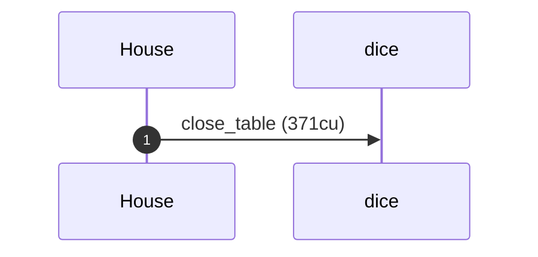
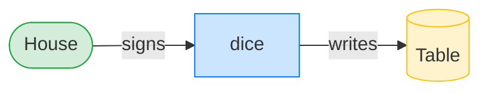
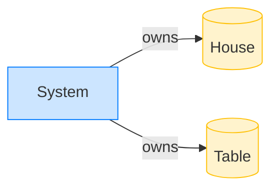

# The house closes an empty table

**Intent.** A table opened but never bet against. The house reclaims its rent with `close_table`.

**Outcome.** The transaction succeeded.

**Source.** [`tests/gambling.rs::the_house_closes_an_empty_table`](../tests/gambling.rs#L404)

## Structured execution log

```
CPI Tree (371 BPF CU / 1,400,000 budget):
└── close_table (371 / 1,400,000 CU) dice (no CPIs)
```

## Sequence diagram



## Authority graph

Who signed for what; an `invoke_signed` PDA appears as its own authority.



## Ownership graph

Which program owns each account the transaction wrote.


