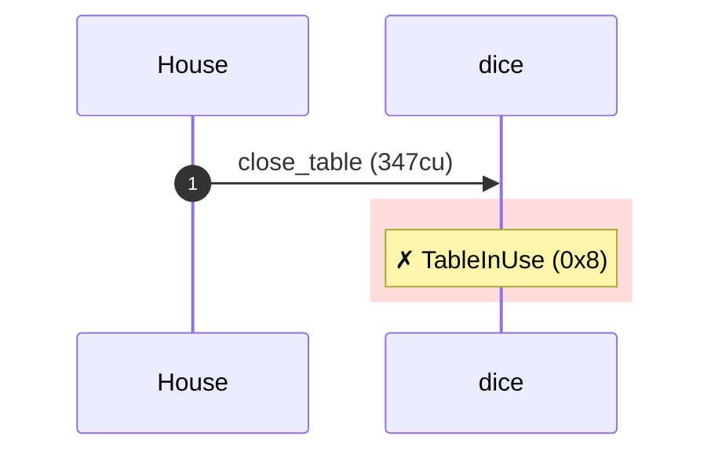
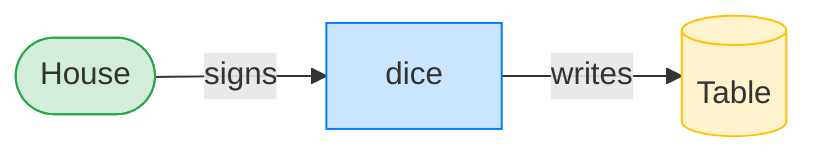
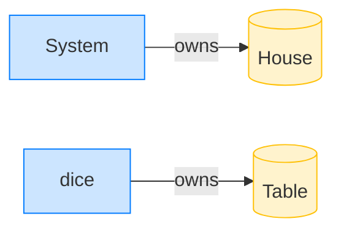

# A close-and-reopen grind is caught

**Intent.** Once a player has bet, the table is claimed. The house's attempt to close it (to reopen with a substituted commitment after seeing the entropy) is rejected with `TableInUse`.

**Outcome.** The transaction failed: `custom program error: 0x8`.

**Source.** [`tests/gambling.rs::a_close_and_reopen_grind_is_caught`](../tests/gambling.rs#L442)

## Structured execution log

```
CPI Tree (347 BPF CU / 1,400,000 budget):
└── close_table FAILED: TableInUse (0x8) (347 / 1,400,000 CU) dice (no CPIs)
```

## Sequence diagram



## Authority graph

Who signed for what; an `invoke_signed` PDA appears as its own authority.



## Ownership graph

Which program owns each account the transaction wrote.


