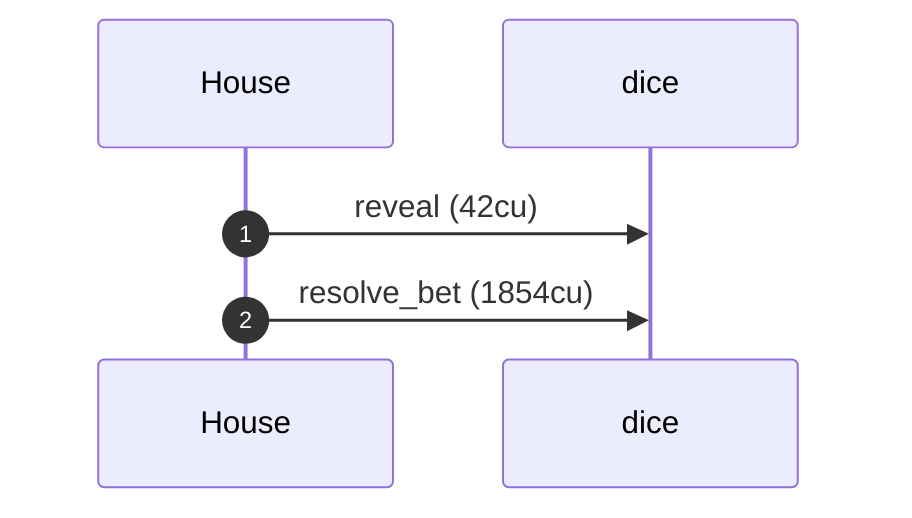
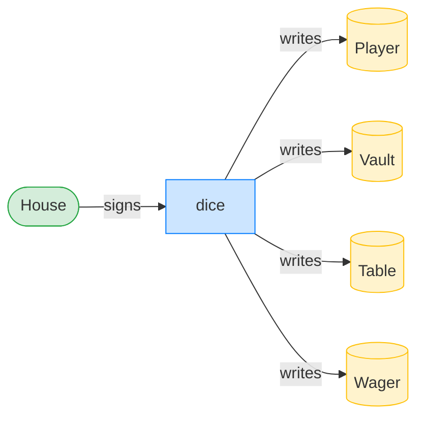
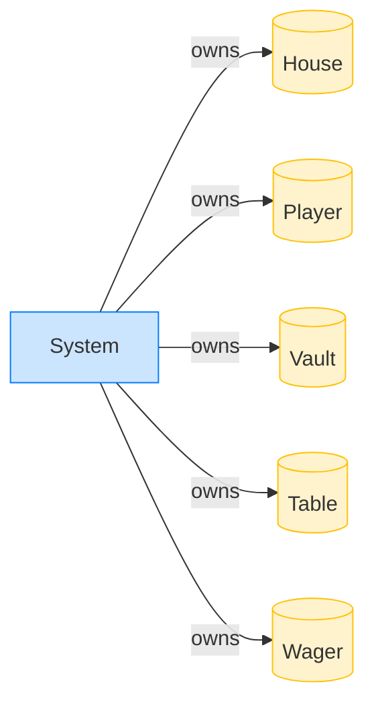

# The house keeps a losing roll

**Intent.** A guess that ties the roll loses. The settle introspects the reveal, finds no win, and the stake stays with the house.

**Outcome.** The transaction succeeded.

**Source.** [`tests/gambling.rs::the_house_keeps_a_losing_roll`](../tests/gambling.rs#L420)

## Structured execution log

```
CPI Tree (1,896 BPF CU / 1,400,000 budget):
├── reveal (42 / 1,400,000 CU) dice (no CPIs)
└── resolve_bet (1,854 / 1,399,958 CU) dice (no CPIs)
```

## Sequence diagram



## Authority graph

Who signed for what; an `invoke_signed` PDA appears as its own authority.



## Ownership graph

Which program owns each account the transaction wrote.


