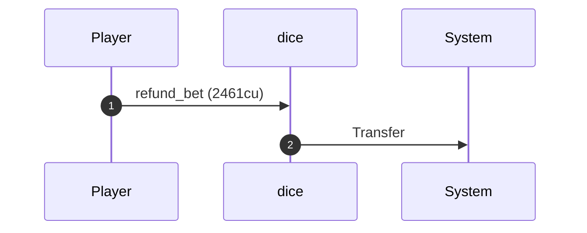
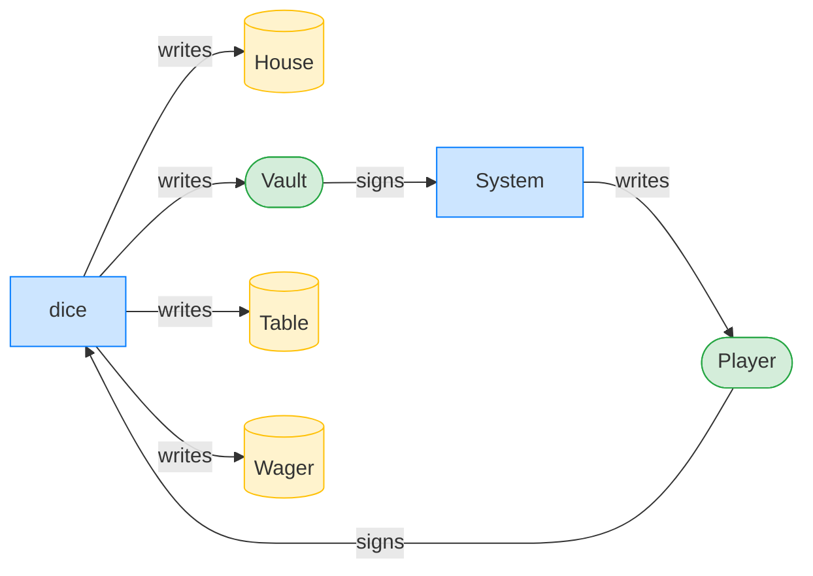
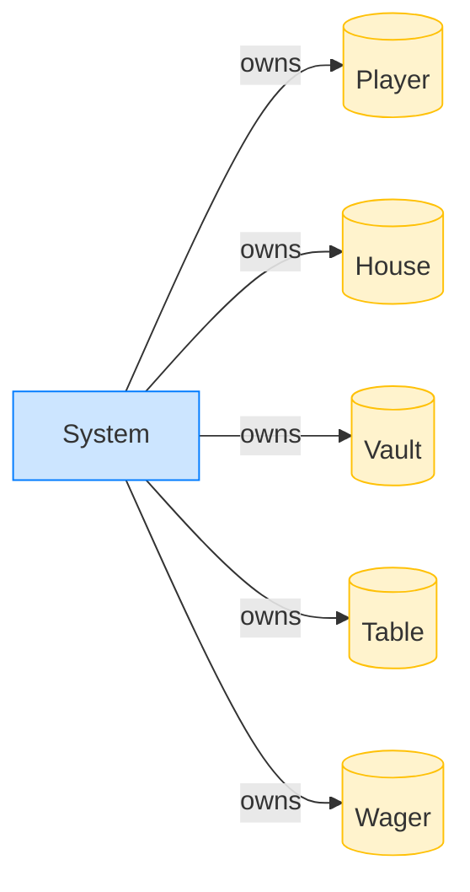

# The house never shows

**Intent.** The house never reveals. After the timeout the player reclaims the stake and the wager closes.

**Outcome.** The transaction succeeded.

**Source.** [`tests/gambling.rs::the_house_never_shows`](../tests/gambling.rs#L366)

## Structured execution log

```
CPI Tree (2,461 BPF CU / 1,400,000 budget):
└── refund_bet (2,461 / 1,400,000 CU) dice
    └── System
```

## Sequence diagram



## Authority graph

Who signed for what; an `invoke_signed` PDA appears as its own authority.



## Ownership graph

Which program owns each account the transaction wrote.


