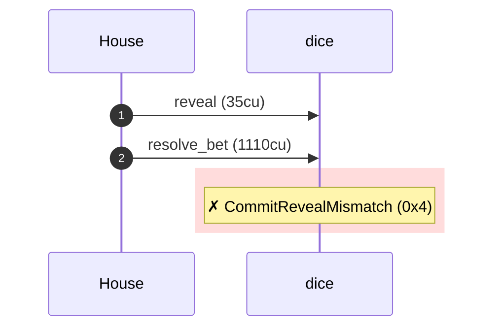
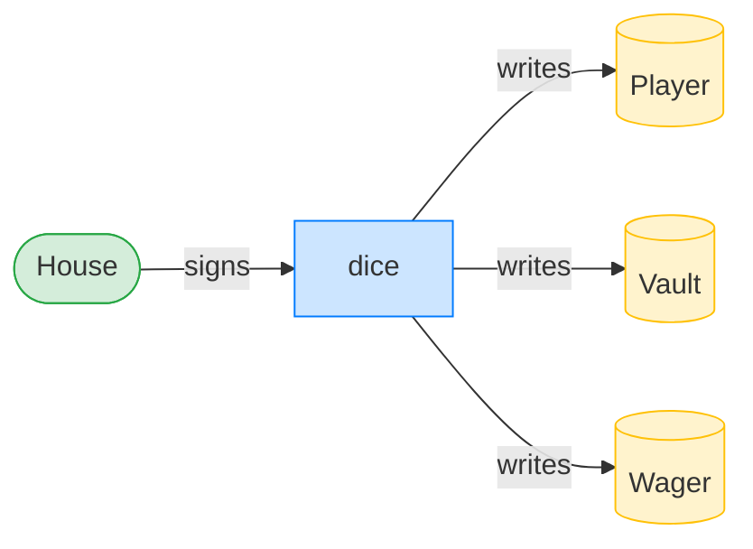
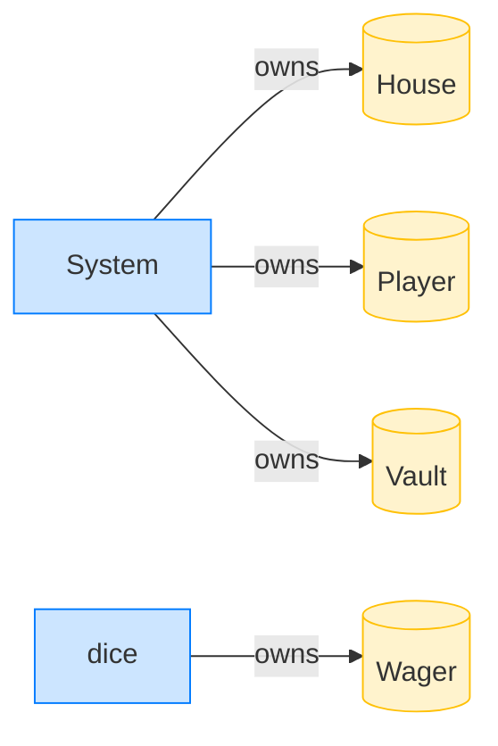

# A switched preimage is caught

**Intent.** The house reveals a preimage that does not open the commitment. `resolve_bet` recomputes sha256 and rejects the settle; the wager survives.

**Outcome.** The transaction failed: `custom program error: 0x4`.

**Source.** [`tests/gambling.rs::a_switched_preimage_is_caught`](../tests/gambling.rs#L411)

## Structured execution log

```
CPI Tree (1,145 BPF CU / 1,400,000 budget):
├── reveal (35 / 1,400,000 CU) dice (no CPIs)
└── resolve_bet FAILED: CommitRevealMismatch (0x4) (1,110 / 1,399,965 CU) dice (no CPIs)
```

## Sequence diagram



## Authority graph

Who signed for what; an `invoke_signed` PDA appears as its own authority.



## Ownership graph

Which program owns each account the transaction wrote.


