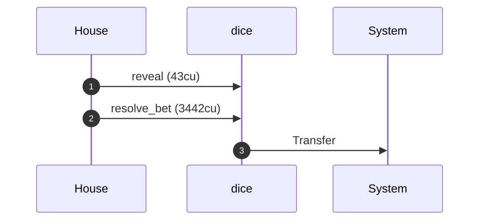
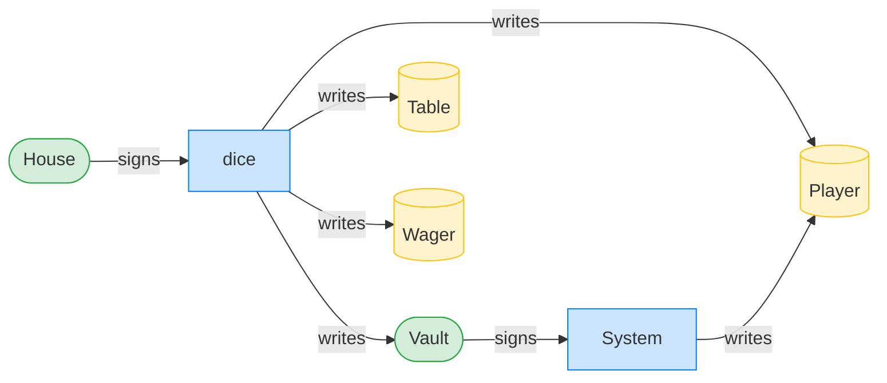
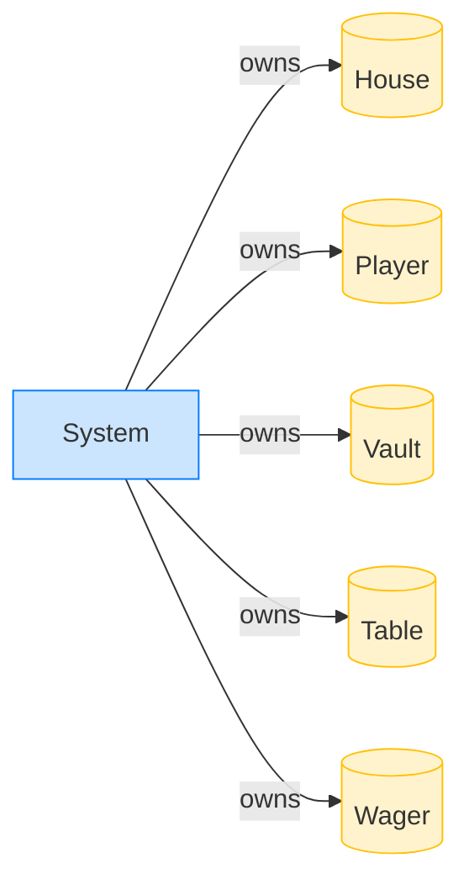

# The house pays a winning roll

**Intent.** A player beats the roll. The house reveals the preimage and settles in one transaction; `resolve_bet` introspects the preceding `reveal` and pays out.

**Outcome.** The transaction succeeded.

**Source.** [`tests/gambling.rs::the_house_pays_a_winning_roll`](../tests/gambling.rs#L416)

## Structured execution log

```
CPI Tree (3,485 BPF CU / 1,400,000 budget):
├── reveal (43 / 1,400,000 CU) dice (no CPIs)
└── resolve_bet (3,442 / 1,399,957 CU) dice
    └── System
```

## Sequence diagram



## Authority graph

Who signed for what; an `invoke_signed` PDA appears as its own authority.



## Ownership graph

Which program owns each account the transaction wrote.


